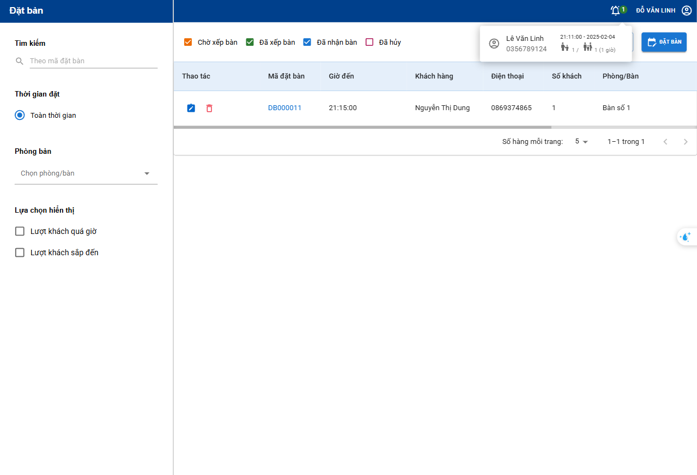
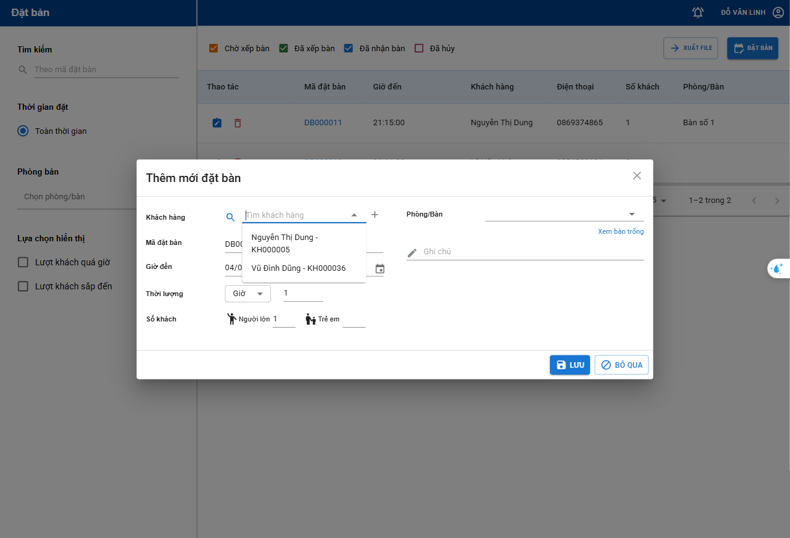
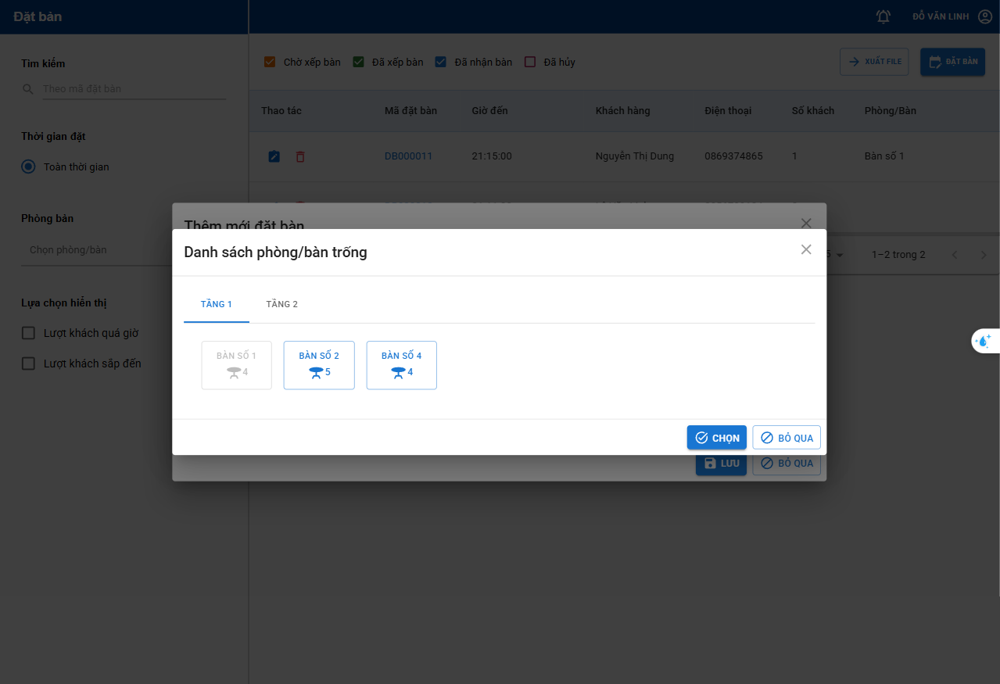
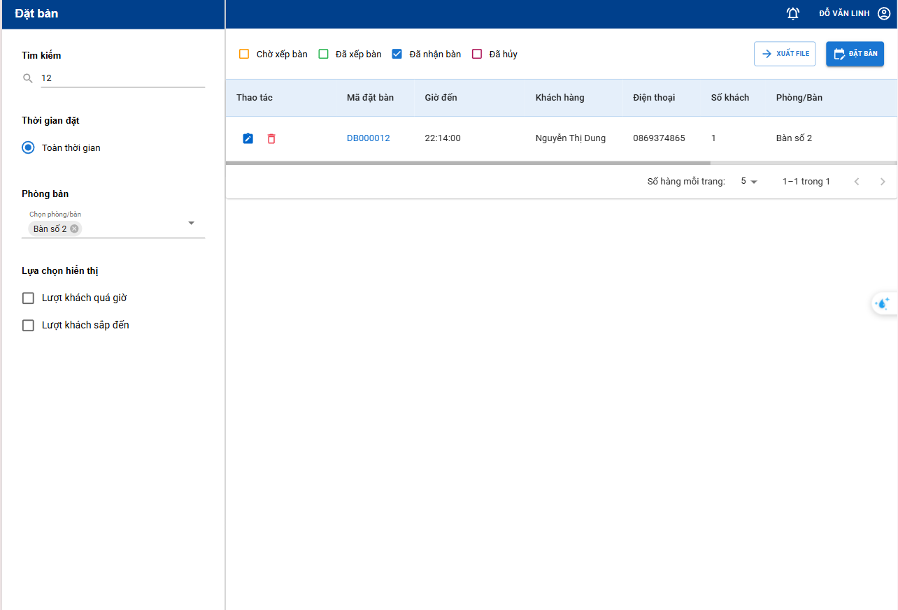
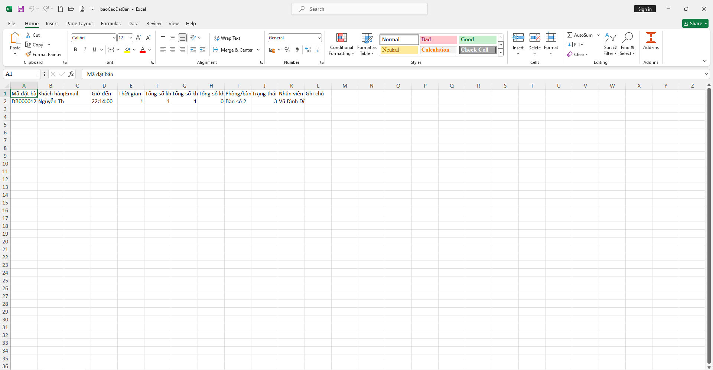
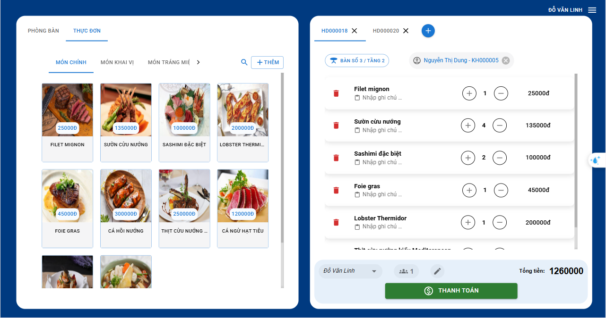
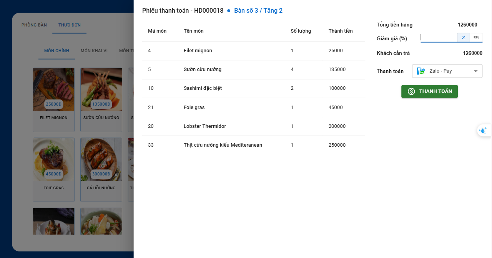
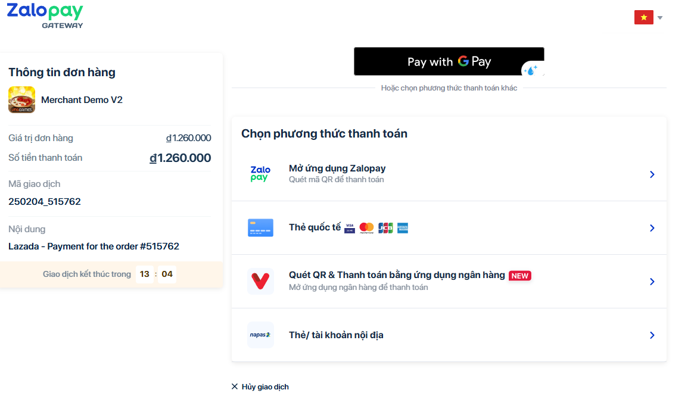

# Introduce 

This is the Staff Page that allows the receptionist to receive online table reservations from customers. In addition, the staff can directly book tables for customers when they come to the restaurant. Here, customers can order food and pay through many different forms.

# Overview 
 
 #### Reception Page

 This page allows the front desk to take online reservations from customers or the front desk can reserve a table for customers when they come to the restaurant.
- #### Receptionist takes table reservations from customers

 

 - #### Receptionist creates table reservation for customer

- #### Receptionist can filter by reservation code, table name, table status

- #### Reception can also export excel 

- #### After successfully arranging the table, the customer's table order will be sent to the cashier. Here, the customer can choose dishes, or change tables,...

- #### And finally payment, customers can choose a variety of payment methods. Here customers choose to pay via Zalo pay

